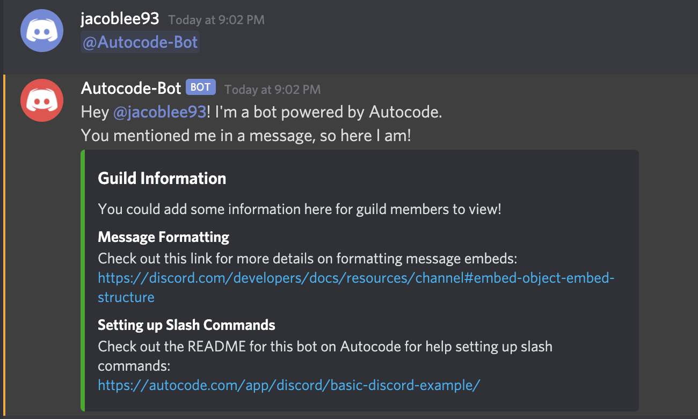
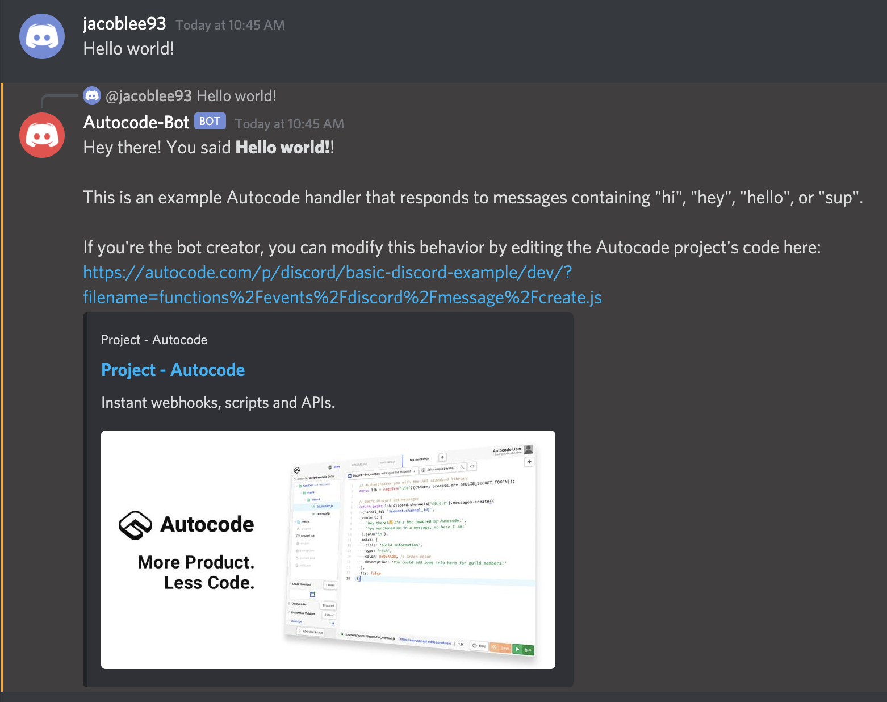
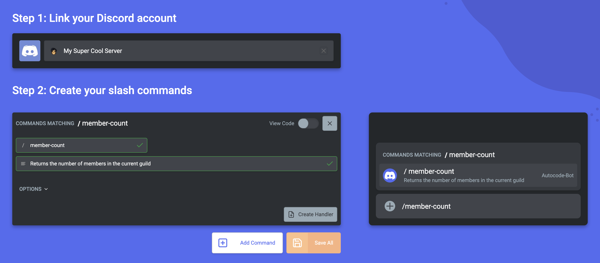
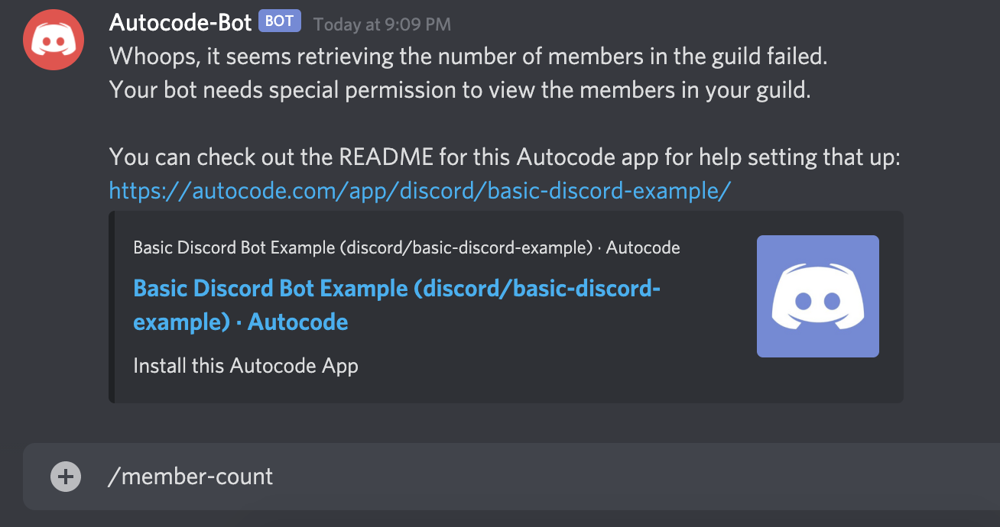
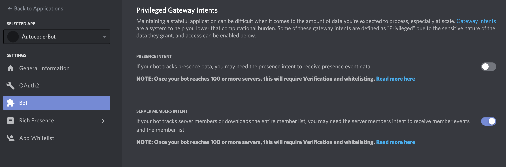
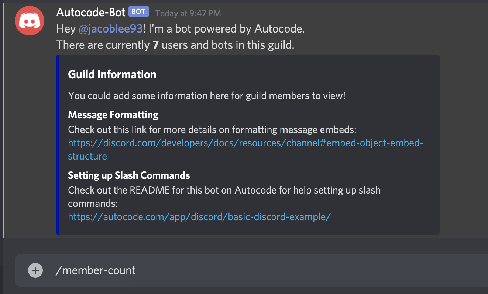

# Basic Discord Bot Example

This is a fully customizable example Discord bot that you can add to your
Discord guild in just a few clicks. You don't need anything other than a Discord
account to get started! After forking and setting up this app, your bot will:

1. Confirm installation with a message to your **#general** channel.
1. Respond when it is tagged in a channel with a friendly, informational message.
1. Replies to messages containing the words **hi**, **hey**, **hello**, or **sup**
with a sample message.
1. Respond to a [Discord slash command](https://discord.com/developers/docs/interactions/slash-commands) 
called `/member-count` with the number of members in the guild.

The slash command requires a bit more setup after forking, but don't worry,
we'll walk through everything here! All behavior is completely customizable by 
editing the app code.

Also, for more in-depth information about building Discord bots on Autocode, 
[click here to check out our official, comprehensive guide](https://autocode.com/guides/how-to-build-a-discord-bot/)!

## Bot Mention Handler

You can find the bot mention handler under 
`functions/events/discord/bot_mention.js`. After creating and naming your bot, then linking
it to Autocode, you can tag it as shown below to see a message like the one below:



## Message Create Handler

The message create handler will echo messages that contain **hi**, **hey**, 
**hello**, or **sup** as a reply to the original message. You can find it under 
`functions/events/discord/message/create.js`. It contains a link where you can
edit your project in the Autocode editor:



The handler responds to the default Discord `message.create` event, and uses
an `if` statement and a regex to only reply to messages with specific contents. 
Here's what it looks like:

```javascript
// Only respond to messages containing the word "hi", "hey", "hello", or "sup"
if (context.params.event.content.match(/\bhi\b|\bhey\b|\bhello\b|\bsup\b/i)) {
  await lib.discord.channels['@0.0.6'].messages.create({
    channel_id: context.params.event.channel_id,
    content: messageContent.join('\n'),
    message_reference: {
      message_id: context.params.event.id
    }
  });
}
```

It's a useful pattern that you can broadly apply to other handlers as well!

**Note**: Autocode, automatically defines a `context` variable containing
information about the incoming request, including the incoming event. To see all the
available fields an event contains, you can view the endpoint's **Payload**.
For more on this, check out [this section of the official guide](https://autocode.com/guides/how-to-build-a-discord-bot/#testing-commands).

## Member Count Command

[Discord slash commands](https://discord.com/developers/docs/interactions/slash-commands) 
require a little bit more setup than the previous bot mention handler, as you
must register them with Discord before you can use them. Additionally,
Discord treats guild member related events and APIs as privileged, which means for
this specific command to work, you'll need to grant those privileges to your bot.

### Registering a Slash Command

After following the instructions to link your newly created Discord bot and
forking this app, you'll need to register the slash command.
Fortunately, you can easily do this with our built-in
[Discord Slash Command Builder](https://autocode.com/discord-command-builder)!
Once on the builder page, link your bot and create a command that looks like this:



For this bot, the `name` must be `member-count`, and description can be whatever
you'd like. We suggest creating the
command as a [guild command](https://discord.com/developers/docs/interactions/slash-commands#what-is-a-slash-command)
rather than a global one for this bot as global commands can take up to an hour
before they are visible, so you should also select the guild you've installed
your bot in.

Leave the **Options** empty for this command &mdash; these are an advanced feature
that allow you to set parameters for your slash command! For more on options,
we recommend you check out our [official, comprehensive Discord guide](https://autocode.com/guides/how-to-build-a-discord-bot/).

You can also directly create new handlers for your commands here, but since this
app already contains a handler, we can skip this step as well. Just press the
**Save All** button in the bottom bar, and you're all set with registering
your command!

### Granting Permissions

The final step to get this command working is to enable `Privileged Gateway Intents` 
for your bot. If you try to run your command before doing so, you'll see a message
like this:



To fix this, go to the 
[Discord developer portal](https://discord.com/developers/applications) and select
your bot out of the list to open your bot's settings. Press the `Bot` tab, then
scroll down until you see a section like the one below:



Enable the `Server Members Intent` using the toggle &mdash; don't forget to press
`Save Changes` afterwards! Then, try running your command again and you
should see something like this:



This will also enable you to receive `guild.member` events for your bot.

## Useful Links

- [Official Guide to Building Discord Bots on Autocode](https://autocode.com/guides/how-to-build-a-discord-bot/)
- [The Discord Slash Command Builder](https://autocode.com/discord-command-builder/)
- [Formatting Discord messages](https://discord.com/developers/docs/reference#message-formatting)
- [Discord slash command docs](https://discord.com/developers/docs/interactions/slash-commands)
- [Discord developer portal](https://discord.com/developers/applications)
- [Autocode discord/commands API page for creating slash commands](https://autocode.com/lib/discord/commands/)
- [How to find your Discord guild id](https://support.discord.com/hc/en-us/articles/206346498-Where-can-I-find-my-User-Server-Message-ID-)

## Thank You!

If you have any questions or feedback, please join our community Discord server 
from the link in the top bar. You can also follow us on Twitter, [@AutocodeHQ](https://twitter.com/@AutocodeHQ).
